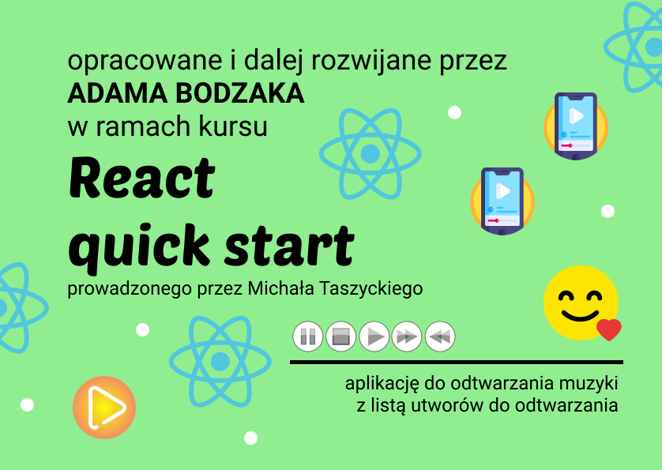

---
# **Kurs Reacta - Szybki Start** - w ramach kursu powstała aplikacja której zadaniem jest odtwarzanie muzyki która jest dostarczana w postali adresów URL z serwera.

Ostateczna wersja aplikacji dostępna jest na serwerze **VERCEL** pod adresem https://course-react-quick-start-michal-taszycki.vercel.app/

---
**Własne funkcjonalności stworzone po za kursem:**

***
Jest to kurs pod nazwą **Kurs Reacta - Szybki Start** stworzony przez **Michała Taszyckiego** dostępny pod adresem https://kursreacta.pl/

Skrócony zakres zagadnień poruszonych w ramach kursu:
1. Komponenty funkcyjne
2. Props - czyli komunikacja między komponentami
3. Renderowanie List i property key
4. Zdarzenie onClick i wywołanie funkcji przekazanej w prop
5. useState
6. useRef
7. useEffect
8. className - Stylowanie aplikacji
9. children prop
10. Deployment na Vercel